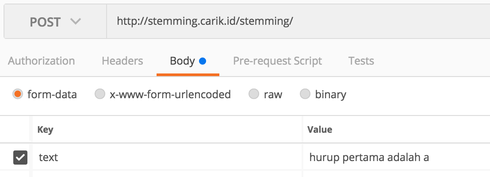

**Stemming Word dengan menggunakan pascal**

[http://stemming.carik.id/](http://stemming.carik.id/)
***

**Stemming** adalah proses pemetaan dan penguraian bentuk dari suatu kata menjadi bentuk kata dasarnya. Stemming sebagai terapan yang erat dalam [Natural Language Processing](https://medium.com/@luridarmawan/natural-language-processing-nlp-sederhana-dari-carik-bot-78952b618695) sangat berguna bagi Anda yang mendalami tools-tools seperti *Translation*, *Summarization* bahkan juga untuk [ChatBot](http://www.carik.id/) seperti [Carik](http://www.carik.id/).
Penggunaan *stemming* secara luas sudah biasa dilakukan di dalam *Information Retrieval* (pencarian informasi) untuk meningkatkan kualitas informasi yang didapatkan.

*Stemming word* yang digunakan di sini berdasarkan Algoritma Nazief dan Adriani,
dibangun dengan menggunakan bahasa pascal khususnya framework [FastPlaz](http://www.fastplaz.com).

Beberapa variasi kata mungkin tidak terdeteksi dikarenakan banyak hal dan kondisi.
belum termasuk sebagian kata-kata gaul maupun yang tidak gaul.

## How to Build It


### Requirements

- [FastPlaz_runtime](http://www.fastplaz.com/)

### Instalasi

**install requirement**

```bash
$ mkdir -p StemmingWord/source/vendors
$ cd StemmingWord/source
$ git clone https://github.com/luridarmawan/StemmingWord.git

# install vendors

$ cd vendors
$ git clone -b development https://github.com/fastplaz/fastplaz.git
```


**Compile dari IDE**

Jika menggunakan Lazarus, buka file "stemming" dan *compile* file tersebut.

Akan terbentuk file binary di 'public_html/stemming/stemming.bin'

**Compile dari Command-Line**

```bash
cd StemmingWord/source/stemming_web/
./clean.sh
./build.sh
.
.
stemming.lpr(13,124)
Assembling (pipe) lib/stemming.s
Compiling resource lib/stemming.or
Linking ../../public_html/stemming/stemming.bin
.
.
source$ _

```

**Custom Build**

untuk konfigurasi custom, misal untuk perubahan path tempat library berada, bisa dilakukan dengan melakukan modifikasi di file **extra.cfg**.

## How to Config It

**cPanel Hosting**

Jika Anda menggunakan hosting dengan platform cPanel, instalasinya cukup mudah.

1. salin isi folder ```public_html/``` ke ```public_html/``` di account hosting anda.
2. beri permission writeable ke folder ```ztemp/```


**VPS/Instance/DS**

Pada dasarnya kurang lebih sama dengan proses instalasi di hosting cPanel. Jika anda punya permission untuk mengubah konfigurasi apache, direkomendasikan menggunakan pola berikut.

```
<VirtualHost *:80>
    ServerName stemming.yourdomain.tld
    DocumentRoot "/your/public_html/path"
    ErrorLog  "/path/for/log/apache2/stemming-error_log"
    CustomLog "/path/for/log/apache2/stemming-access_log" common

    <Directory "/your/public_html/path/">
        Options +ExecCGI +Indexes
        AddHandler cgi-script .bin
        Require all granted
        AllowOverride All
    </Directory>
</VirtualHost>
```

## How to Use It

Pastikan Anda sudah bisa mengakses url web service anda dengan benar. **StemmingWord** tools ini didesain untuk sekaligus sebagai API dan menggunakan POST Method dalam setiap proses transaksinya.

Pengujian bisa dilakukan dengan API Test Tools, seperti PostMan, Fortress, Mocky.io, curl, dsb.

**parameter:**

text = text yang akan distemming.



**Contoh Response**

```
{
  "code" : 0,
  "response" : {
    "word_count" : 4,
    "nonstandardword_count" : 1,
    "unknownword_count" : 0,
    "text" : [
      {
        "word" : "huruf",
        "wordtype" : "Nomina",
        "type" : "2",
        "non_standard" : "yes",
        "original_word" : "hurup",
        "score" : "0"
      },
      {
        "word" : "pertama",
        "wordtype" : "Numeralia",
        "type" : "6",
        "score" : "0"
      },
      {
        "word" : "adalah",
        "wordtype" : "Verba",
        "type" : "4",
        "score" : "0"
      },
      {
        "word" : "a",
        "wordtype" : "Nomina",
        "type" : "2",
        "score" : "0"
      }
    ],
    "time" : "42ms"
  }
}
```


## Demo

Live demo tools ini bisa anda akses dari halaman [Carik Stemming Tools](https://stemming.carik.id/)
